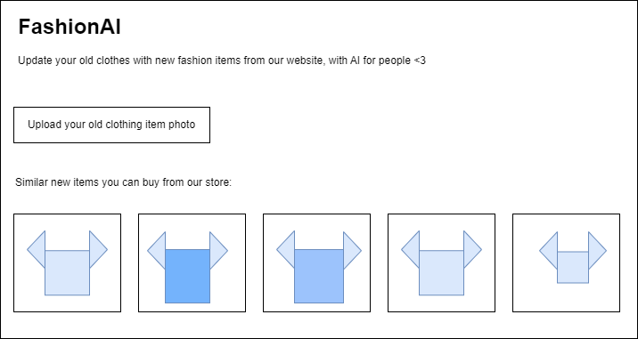
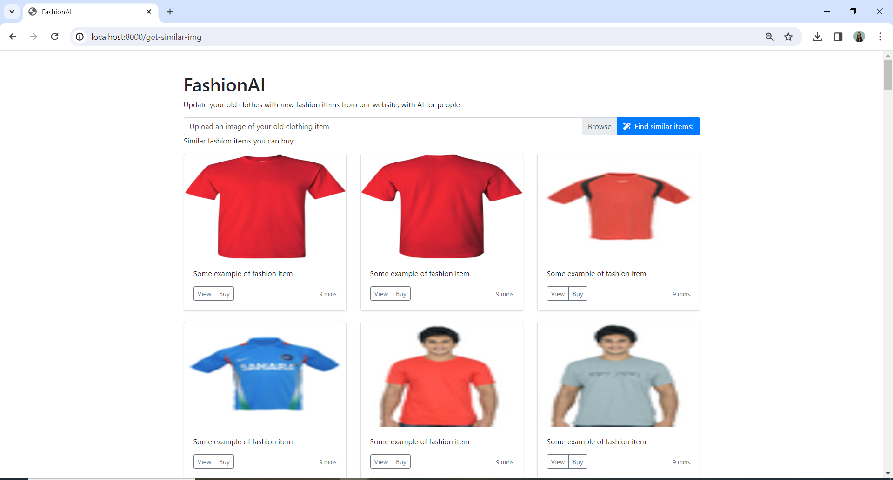

# FashionAI
AI for sustainable replacement of old clothes with new fashion items

Frontend for the MVP 1:



<hr>

Implementation of the MVP1:



## Installation and requirements
- python 3.12
- fastapi
- uvicorn

## Running the code
```$ uvicorn main:app --reload```

## Additional resources and links
This project references https://github.com/mdiannna/AIRecommenderSimilarPosts
